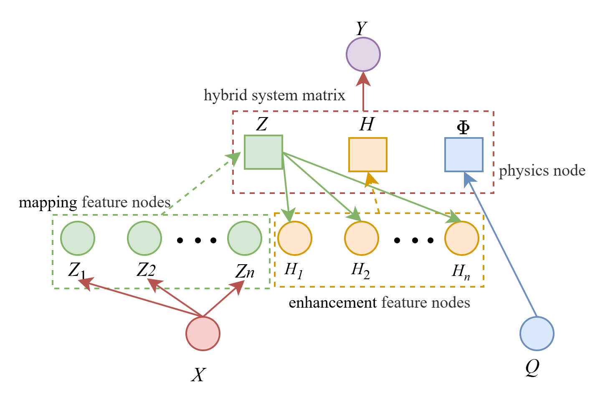

# 0.参考资料

[混合模型关节力矩估计 | Google AI Studio](https://aistudio.google.com/prompts/1GDOgnhXr-Rzx0DZzWyQuZLTMkaAvRC5g)

# 1.公式方法推导

## 1.1.问题描述

初始训练输入为 $N$ 组样本，其输入可分为数据驱动的输入 $X \in \mathbb{R}^{N \times D}$ 以及物理驱动的输入 $Q \in \mathbb{R}^{N \times B}$, 输出为 $Y \in \mathbb{R}^{N \times C}$ 。最终初始训练得到映射 $f$ 使得针对测试集输入 $X_{test}$ 和 $Q_{test}$ 有：

$$
\hat{Y}_{test}=f(X_{test},Q_{test})
$$

$\hat{Y}_{test}$ 为针对测试集的输出预测。

当有增量训练数据 $M$ 组样本，其数据驱动的输入 $X_a \in \mathbb{R}^{M \times D}$ 与 物理驱动的输入 $Q_a \in \mathbb{R}^{M \times B}$ ,输出 $Y_a \in \mathbb{R}^{M \times C}$ ，增量学习得到新的映射 $f^{*}$ 使得针对测试集输入 $X_{test}$ 和 $Q_{test}$ 有：

$$
\hat{Y}_{test}=f^*(X_{test},Q_{test})
$$

## 1.2.网络结构

针对于 $n$ 组映射特征节点（mapping feature node）。第 $i$ 组 $Z_{i}$ 可表示为：

$$
Z_i = \varphi_i\left(XW_{m_i} + \beta_{m_i}\right),\quad i=1,2,\dots,n
$$

其中 $W_{m_i}$ 和 $\beta_{m_i}$ 是随机生成的正交权重和偏置， $\varphi_i$ 是稀疏自编码器变换或线性激活。

将所有的映射特征节点拼接，得到：

$$
Z = [Z_1, Z_2, \dots, Z_{n}]
$$

将 $Z$ 作为输入，得到 $m$ 组增强特征节点（enhancement feature node）。第 $j$ 组 $H_{j}$ 可表示为：

$$
H_j = \xi_j\left(Z^{n}W_{e_j} + \beta_{e_j}\right),\quad j=1,2,\dots,m
$$

其中 $W_{e_j}$ 和 $\beta_{e_j}$ 是随机生成的正交权重和偏置， $\xi_j$ 是稀疏自编码器变换或非线性激活。

将所有的增强特征节点拼接，得到：

$$
H = [H_1, H_2, \dots, H_{m}]
$$

物理特征节点（Physics Node）的表达式可以表示为:

$$
\Phi = g(Q)
$$

其中 $Q$ 为物理驱动的输入，其经过对应的映射得到 $\Phi \in \mathbb{R}^{N \times C}$

将映射特征节点 $Z$ ,增强特征节点 $H$ 和物理特征节点 $\Phi$ 横向拼接为最终的混合系统矩阵 $\tilde{A}$ :

$$
\tilde{A}=[Z \mid H \mid \Phi]=[A \mid \Phi]
$$

预测扭矩 $\hat{Y}$ 为各节点的线性组合

$$
\hat{Y}=\tilde{A}W=AW_d+\Phi W_p
$$

其中 $W$ 为系统权重：

$$
W = \begin{bmatrix}
W_d \\
W_p
\end{bmatrix}
$$

## 1.3.物理特征节点的求解

基础物理扭矩 $\Phi$ 的计算：

$$
\Phi = M(q)\ddot{q} + C(q,\dot{q})\dot{q} + G(q)
$$

其中 $M(q)$ 是系统的**惯性矩阵**， $C(q,\dot{q})\dot{q}$ 为**离心力项**， $G(q)$ 为**重力项**

$$
M(q)=I_{cm}+m⋅d^2
$$

其中 $I_{cm}=\frac{1}{12}mL^2$, $m$ 为小腿和脚的总质量， $L$ 为总长度， $d$ 为质心到膝关节的长度。

对于单自由度膝关节，离心力项 $C(q,\dot{q})\dot{q}=0$.

$$
G(q) = m \cdot g \cdot d \cdot \cos(q)
$$

其中m为小腿和脚的总质量， $d$为质心到膝关节的长度， $q$ 为膝关节屈曲角（伸直为0度）

## 1.4.系统权重的求解

岭回归损失函数：

$$
J(W_d, W_p) = \frac{1}{2}\left\|Y - \left(A W_d + \Phi W_p\right)\right\|_F^2 + \frac{\lambda_1}{2}\left\|W_d\right\|_F^2 + \frac{\lambda_2}{2}\left\|W_p - I\right\|_F^2
$$

其中 $\lambda_1$ 和 $\lambda_2$ 为正则化参数。

为了算损失函数的全局最小值，我们分别对 $W_d$ 与 $W_p$ 求偏导并令其为零

$$
\frac{\partial J}{\partial W_d} = -A^T\left(Y - A W_d - \Phi W_p\right) + \lambda_1 W_d = 0
$$

$$
\frac{\partial J}{\partial W_p} = -\Phi^T\left(Y - A W_d - \Phi W_p\right) + \lambda_2\left(W_p - I\right) = 0
$$

联立等式(14)与(15)，得到矩阵等式：

$$
\begin{bmatrix}
A^T A + \lambda_1 I_d & A^T \Phi \\
\Phi^T A & \Phi^T \Phi + \lambda_2 I_p
\end{bmatrix}
\begin{bmatrix}
W_d \\
W_p
\end{bmatrix}=
\begin{bmatrix}
A^T Y \\
\Phi^T Y + \lambda_2 I_p
\end{bmatrix}
$$

其中 $I_d$ 和 $I_p$ 分别为维度和 $W_d$ 和 $W_p$ 一致的单位矩阵。

定义广义正则化矩阵 $\Lambda$ :

$$
\Lambda = \begin{bmatrix}
\lambda_1 I_d & 0 \\
0 & \lambda_2 I_p
\end{bmatrix}
$$

定义物理偏执向量 $B_{phy}$:

$$
B_{\text{phy}} = \begin{bmatrix}
0 \\
\lambda_2 I_p
\end{bmatrix}
$$

则(16)可简化为：

$$
\left(\tilde{A}^T \tilde{A} + \Lambda\right) W = \tilde{A}^T Y + B_{\text{phy}}
$$

等式左右同乘逆矩阵，得到 $W$ 的表达式：

$$
W = \left(\tilde{A}^T \tilde{A} + \Lambda\right)^{-1} \left(\tilde{A}^T Y + B_{\text{phy}}\right)
$$

定义 $P$:

$$
P=\left(\tilde{A}^T \tilde{A} + \Lambda\right)^{-1}
$$

则 $W$ 的表达式可简化为：

$$
W = P \left(\tilde{A}^T Y + B_{\text{phy}}\right)
$$

## 1.5.增量学习算法

 同公式(3-7） ， $X_a$ 通过计算得到增量映射特征节点 $Z_a$ 与增量增强特征节点 $H_a$

$Q_a$ 通过计算得到增量物理节点 $\Phi_a$

拼接得增量的混合系统矩阵 $\tilde{A}_a$:

$$
\tilde{A}_a=[Z_a \mid H_a \mid \Phi_a]
$$

则旧数据与新数据的整体更新矩阵 $\tilde{A}^*$ 与整体输出为：

$$
\tilde{A}^* = \begin{bmatrix}
\tilde{A} \\
\tilde{A}_a
\end{bmatrix}
$$

$$
Y^* = \begin{bmatrix}
Y \\
Y_a
\end{bmatrix}
$$

则由公式(22)可得新的权重 $W^*$ :

$$
W^* = P^* \left( \left( \tilde{A}^* \right)^T Y^* + B_{\text{phy}} \right)
$$

其中 $P^*$ 的计算公式为：

$$
P^* =\left( \left( \tilde{A}^* \right)^T \tilde{A}^* + \Lambda\right)^{-1}
$$

则结合公式(24)(25),公式(26)可化简为：

$$
W^* = P^* \left( \tilde{A}^T Y + A_a^T Y_a + B_{\text{phy}} \right)
$$

由公式(22),公式(28)可化简为：

$$
W^* = P^* \left( P^{-1} W + A_a^T Y_a \right)
$$

结合公式(27)(22)可得：

$$
P^* = \left( P^{-1} + A_a^T A_a \right)^{-1}
$$

结合公式(30),公式（29）可表示为：

$$
W^* = P^* \left[ \left(\left( P^*\right)^{-1} - A_a^T A_a \right) W + A_a^T Y_a \right]
$$

即为：

$$
W^* = W + P^* A_a^T \left( Y_a - A_a W \right)
$$

## 1.6.简化 $P^*$ 的计算

由公式(30)在计算 $P^*$ 时,其中求解 $P^{-1}$这一大矩阵的逆，十分消耗算力，所以我们使用以下的数学方法解决。

利用Woodbury 恒等式

$$
(A + U C V)^{-1} = A^{-1} - A^{-1} U \left( C^{-1} + V A^{-1} U \right)^{-1} V A^{-1}
$$

令 $A=P^{-1}$, $U=A_a^T$, $V=A_a$.则有：

$$
P^* = P - P A_a^T \left( I + A_a P A_a^T \right)^{-1} A_a P
$$
